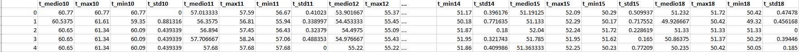
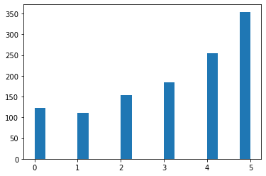
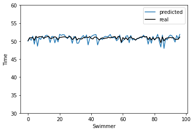
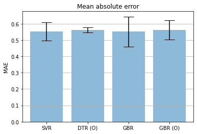

# Regression analysis for predicting swimmers' performance

Regression algorithms for predicting the performance of an 18 year old swimmer based on its records at younger ages (10 to 15). Data can retrieved from the website [1] as CSV using different filters (age, gender, etc.). The approach bases in [2] although different regressors techniques have been employed.

# Data

Details of the dataset | Values
--- | ---
Total number of swimmers | 1180
Gender | Female
Course | 100 yards FR (freestyle) 
Period | from 2000 to 2021
Input   | times at the age of 10 to 15 
Output  | time at 18 yo

Each record is made of the several times representing mean, maximun and minimun time and standard deviation exhibited by a single swimmer at the ages from 10 to 15 and 18. Whereas mean values estimate the overall performance, maxima, minima and standard deviation give a measure of the stability of the training. The objective is to predict the average time of a swimmer at the age of 18 based on its records at younger ages.

   

A swimmer may not have a complete record, i.e. this menas that some records from 10 to 15 year old are missing. The number of missing ages follows the following distribution:

   

In our data, only 123 swimmers have a complete record (zero missing data, first bar). To increase the number of swimmers, we allowed them to have one missing age (first and second bars in the bar plot).

Details | Value
--- | ---
Number of swimmers | 386
Train size | 288
Test size  | 98
Scaling    | [0, 1]

Missing data were represented as NaNs and filled with the median of the column. Records made of single times (only one race at a given age) exhibit an unrealistic zero standard deviation, these values were also substituted by the variance of the columnn. 

# Models
Three different models were used: Support Vector Regressor (SVR), Decission Tree Regressor (DTR) and Gradient Boost Regressor (GBR). Training data was used with 5-fold corss-validation with different settings for the hyperparameters. The best model according the mean absolute error (MAE) was chosen.

# Predictions

Time predicted by each swimmer in the testing dataset using the SVR model.

   

# Comparative analysis

   

All models exhibit a comparable MAE. Optimized Decision Tree Regressor, DTR(O), exhibits the best standard deviation. The MAE is half a second and seems reasonable for predicting the performance level that a young swimmer will reach when starting the university. 

# References

[1] https://www.usaswimming.org/

[2] Jiang Xie,  Junfu Xu,  Celine Nie,  Qing Nie, Machine learning of swimming data via wisdom of crowd and regression analysis, Mathematical Biosciences & Engineering 2017, 14(2): 511-527 doi: 10.3934/mbe.2017031
